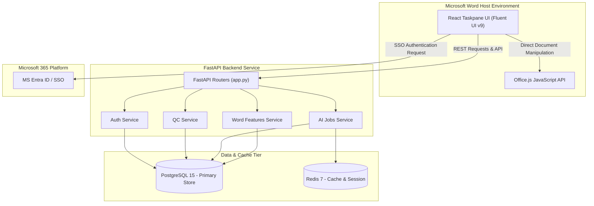

# Architecture Overview & Microsoft Word Add-in Integration

This document outlines the system architecture of the **Klara QA/QC Word Add-in** and details the end-to-end integration of the **Office.js JavaScript API** with the **Klara FastAPI Backend**.

---

## 1. High-Level Core Architecture

The Klara Word Add-in is designed as a client-side Office Add-in hosted within Microsoft Word (Desktop, Online, and Mac). The user interface is built using React and Microsoft's Fluent UI v9 library to provide a native Office experience, communicating asynchronously with a FastAPI backend.



### Component Breakdown

1. **Frontend Taskpane (React Client)**:
   - A React SPA built with TypeScript, structured using Webpack 5.
   - Leverages **Fluent UI React Components v9** for high-fidelity native Microsoft Office styling and accessibility.
   - Communicates with the backend using **Axios** with automatic token-based authentication and refresh interceptors.
2. **Microsoft Office.js API**:
   - The native JavaScript API provided by Microsoft Word to interact directly with document content, styles, comments, and settings.
   - Encapsulated within a custom integration layer (`word-context.ts`) to manage transaction boundaries safely via `Word.run`.
3. **Backend Service (FastAPI)**:
   - Built on **FastAPI** (Python) to provide asynchronous CRUD APIs and background job management.
   - Provides router-level modules for authentication, document records, QC checklists, AI processing jobs, and advanced Word synchronization features (e.g., track changes and co-authoring).
4. **Data & Cache Tier**:
   - **PostgreSQL**: Stores persistent relational models including users, documents, QC findings, checklist rules, and background AI jobs.
   - **Redis**: Serves as a fast cache, token blacklist, and Celery broker for async job queues.

---

## 2. Microsoft Word Add-in Integration

The integration allows document specialists to view AI-generated QC suggestions, reject or apply corrections, track document compliance checklists, and execute custom automation workflows.

### A. Infrastructure, Manifest & Hosting

Word discovers and mounts the Add-in via an XML manifest or Microsoft Teams JSON manifest:

- **Manifest Specifications**:
   - `manifest.xml`: Configures the Office Add-in host (`Word`), permissions, icons, and points Word to the HTTPS dev server.
   - `manifest.json`: Represents the modern Teams/unified app manifest for cross-platform M365 deployment.
- **Local Development Hosting**:
   - The Add-in runs on a local HTTPS server (`webpack-dev-server` on port `3000`) using self-signed development certificates (`office-addin-dev-certs`).
   - Debugging config is embedded within VS Code (`.vscode/launch.json` and `tasks.json`) to automatically sideload the manifest in Word Desktop.

---

### B. Office.js API & Integration Layer

The integration layer ([word-context.ts](file:///C:/Users/Int202613/Documents/Github/klara-ai-implementation-plan/KlaraApp/src/taskpane/word-context.ts)) abstracts raw Office.js commands into reliable asynchronous helpers.

```
                      ┌────────────────────────────────────┐
                      │    Microsoft Word Client (Office)  │
                      └──────▲──────────────────────▲──────┘
                             │ 1. getSsoToken()     │ 4. word-context.ts
                             │ (Office.context.auth)│ (Word.run manipulations)
                             ▼                      ▼
┌─────────────────────────────────────────────────────────────────────────────────┐
│                          React Taskpane SPA (Fluent UI v9)                      │
└──────▲───────────────────┬──────────────────────────────────────────────────────┘
       │ 2. API Request    │ 3. Return QC Findings / Job Status
       │ (Authorization)   │
       ▼                   ▼
┌─────────────────────────────────────────────────────────────────────────────────┐
│                           FastAPI Backend (app.py)                              │
└─────────────────────────────────────────────────────────────────────────────────┘
```

#### 1. Context Boundaries & Batching (`Word.run`)
All document operations execute within a transactional boundary:
```typescript
await Word.run(async (context) => {
  // 1. Stage changes (e.g. search, edit, style)
  // 2. Load properties
  await context.sync(); // Flush staged operations to Word
});
```

#### 2. Navigation & Visual Sync
- **Interactive Selection**: When a suggestion is clicked, `searchAndSelect(text, occurrence)` searches the document body and highlights the target range.
- **Viewport Scrolling Workaround**: To force Word Desktop to scroll the selection into the viewport, a temporary Content Control is wrapped around the target range, selected, and then deleted:
  ```typescript
  const tempControl = range.insertContentControl();
  tempControl.select();
  await context.sync();
  tempControl.delete(true); // Keep text contents
  await context.sync();
  range.select();
  ```

#### 3. Search Variation Heuristics
Due to differences in character encodings, typography, and line breaks in Word documents, exact-match searches frequently fail. The Add-in implements `generateSearchVariations(text)` to automatically try:
- Canonical Unicode decomposition/composition normalization (`NFC`).
- Substitution of non-breaking spaces (`\u00A0`) and zero-width spaces (`\u200B`).
- Typography normalization mapping curly quotes/apostrophes (`\u2019`, `\u2018`) to straight ones (`'`), and dashes (`\u2013`, `\u2014`) to hyphens.
- Special character replacements (e.g. sectional symbols `§`, section symbols, copy/registered symbols).
- Wildcard match fallback (`matchWildcards: true`), swapping non-alphanumeric characters with `?`.

#### 4. Inline Commenting
Klara can insert editorial comments directly into the document structure to provide contextual feedback:
- **Anchored Comments**: Appends comments directly onto a text range using `range.insertComment(commentText)`.
- **Paragraph Comments**: If the anchor text cannot be found, `createKlaraCommentAtParagraph(paragraphIndex, commentText)` inserts a comment at the specific paragraph index.

---

### C. Authentication & State Synchronization

#### 1. Authentication Layer
- **Microsoft Single Sign-On (SSO)**: The Add-in requests a bootstrap token from the Office host:
  ```typescript
  const token = await window.Office.context.auth.getAccessToken({
    tenantId: 'common',
    clientId: 'common'
  });
  ```
  This token is exchanged with the FastAPI backend for a Klara JWT.
- **Fallback Credentials**: If SSO is unavailable, the user authenticates via a standard email and password login.

#### 2. Axios Request Interceptor & Token Refresh
To maintain seamless user sessions, the HTTP client ([client.ts](file:///C:/Users/Int202613/Documents/Github/klara-ai-implementation-plan/KlaraApp/src/taskpane/api/client.ts)) registers request and response interceptors:
- **Request Interceptor**: Appends the current JWT to headers: `Authorization: Bearer <accessToken>`.
- **Response Interceptor (401 Handler)**: Hijacks 401 Unauthorized errors, locks execution, calls the backend `/auth/refresh` endpoint with the stored `refreshToken`, saves the new token pair, and automatically replays the initial request.

#### 3. QC Suggestion Acceptance/Rejection
- **Accept**: The client calls `replaceTextInParagraph` to find the original text in the specified paragraph and replaces it with `replacement_text`. On success, it calls `PATCH /qc/findings/{id}/resolve` with `status: 'accepted'`.
- **Stale Detection**: If the original text is not found anywhere in the document (the user may have modified it manually), it is marked as `accepted` in the backend with `not_found_in_document: true` and `auto_resolved: true` notes to clear it from the UI.
- **Reject**: Updates the backend status to `rejected` (`PATCH /qc/findings/{id}/resolve`) to dismiss the card.

#### 4. Background Job Polling
The Workflows tab triggers long-running AI operations (Full QC, Templates, Table of Authorities creation, Table of Contents creation, PDF comparisons) and tracks status dynamically:
- Triggers a job at `POST /ai-jobs`.
- Uses a React `useRef` timer loop to poll `GET /ai-jobs/{jobId}` every 3 seconds.
- Implements safety limits (such as a maximum of 5 consecutive network failures) to prevent infinite loops, and automatically clears timers on component unmount.
