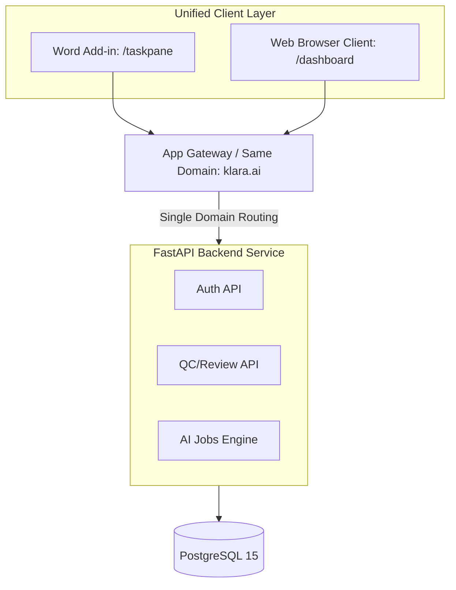
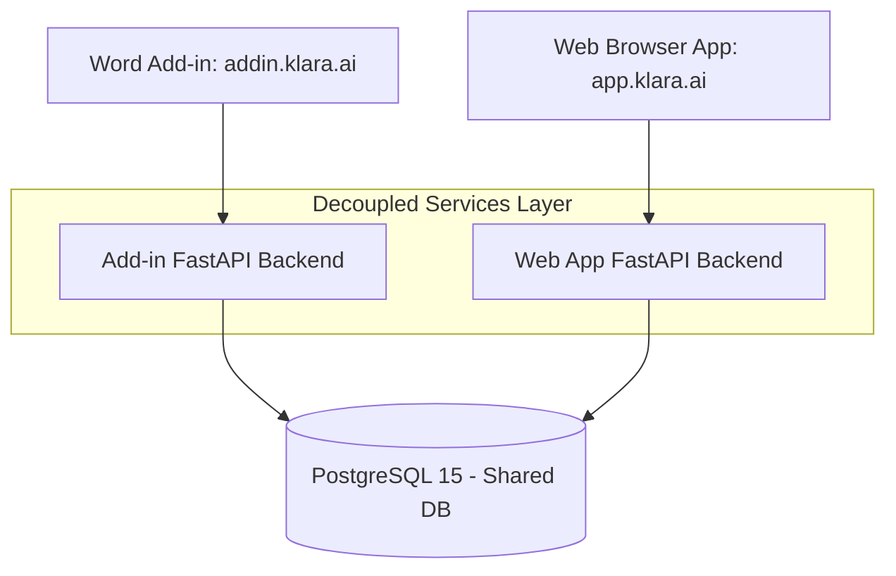

# Architecture Report: Centralized vs. Standalone Office Add-in Strategy

This report evaluates the structural, operational, and development trade-offs of **centralizing** the Klara Word Add-in within the main Klara Web Application vs. maintaining them as **standalone** systems sharing a database.

---

## 1. Executive Summary

As Klara expands from a Word Add-in into a broader web platform (or vice versa), the deployment strategy significantly impacts developer velocity, authentication security, and operations.

### Recommendation
**A Hybrid Centralized Monolithic Backend with a Unified, Code-Split Frontend** is the recommended path. 
* **Backend**: Serve both the web app and the Add-in from the same FastAPI backend.
* **Frontend**: Build them in a monorepo, served from the **same domain/origin**, using React route-splitting (`/app/*` for the web app, `/taskpane/*` for the Add-in).

This maximizes code reuse and dramatically simplifies MS365 Entra ID SSO configurations, while avoiding the dependency hell and schema misalignment of decoupled database access.

---

## 2. Comparison of Approaches

### Option A: Centralized App (Unified Codebase, Origin, and Backend)

In this model, the Word Add-in is simply a specialized view (route) of the main Klara web application, served from the same domain (e.g., `https://klara.ai/taskpane.html`). Both applications share the same FastAPI backend services, schemas, and assets.

#### Pros
* **SSO Simplification**: Both apps share a single Entra ID registration because they run under the same origin. No complex multi-app permissions or multi-origin trust configurations.
* **100% Shared Business Logic**: Models, schemas, DTOs, and utility services (like search variation heuristics) are instantly available to both clients without packages/vendoring.
* **DRY UI Layer**: Direct reuse of React components (e.g. findings cards, diff visualizers, and Chat components).
* **Synchronized Database Migrations**: Since there is only one backend service, database migrations are applied atomically, eliminating version mismatches.

#### Cons
* **Asset Bloat**: Loading a massive Web App bundle inside a Microsoft Word taskpane can degrade startup time unless strict Webpack/Vite code-splitting is configured.
* **Tighter Coupling**: A bug deployed to the main web app could potentially crash the taskpane client if they share shared state/initializers.

---

### Option B: Standalone Apps (Separated Apps & Pipelines)

In this model, the Word Add-in and Web App are treated as separate products, built from different codebases (or separate packages in a monorepo) and deployed to separate domains (e.g., `https://addin.klara.ai` vs `https://app.klara.ai`). They directly query the same PostgreSQL database.

#### Pros
* **Deployment Isolation**: The Add-in and Web App can be deployed independently. A regression in the web app does not block Word Add-in users.
* **Highly Optimized Bundles**: The Add-in bundle only includes the bare minimum required for Word interaction, maximizing load speed.
* **Independent Scalability**: High-frequency API calls from Word (e.g., during real-time document typing analysis) can be scaled separately from the main dashboard views.

#### Cons
* **CORS & Cookie Complexity**: Cross-Origin Resource Sharing (CORS) must be configured between the different domains. Shared authentication states/session cookies become difficult to manage without domain wildcard setups.
* **SSO Administrative Overhead**: Office SSO requires configuring a separate Entra ID application registration for each domain or dealing with complex trust hierarchies.
* **Database Schema Synchronization Hazards**: When both backends write directly to the same database, database schema changes (Alembic migrations) must be carefully coordinated to avoid breaking the opposing application.

---

## 3. Evaluation Criteria Analysis

| Criteria | Centralized (Unified) | Standalone (Decoupled) | Analysis / Impact |
| :--- | :---: | :---: | :--- |
| **Authentication & SSO** | **Winner** | | Office Add-ins run inside a sandboxed iframe. Microsoft SSO (`getAccessToken`) has strict constraints on domains. Having a single domain eliminates CORS and third-party cookie blocking issues. |
| **Component Reuse** | **Winner** | | Both clients need to display suggestions, diff views, checklists, and chat. Centralization allows direct reuse of Fluent UI v9 components. |
| **Operational Simplicity** | **Winner** | | Deploying one service is significantly easier than managing two distinct build files, domain certificates, and manifest URLs. |
| **Performance / Startup** | | **Winner** | Word taskpanes run in embedded browser frames (e.g. Edge WebView2 on Windows, Safari on Mac). Standalone apps ensure a smaller JS payload, speeding up startup times. |
| **Scale & Blast Radius** | | **Winner** | A failure in the web app does not impact the Word plugin. Standalone apps isolate performance bottlenecks. |

---

## 4. Architectural Verdict & Strategy

### The Verdict: Centralized (Unified Monolith with Code-Splitting)
For Klara, **centralization** is the superior strategy. The complexities of cross-domain Office SSO, CORS, component synchronization, and database migration coordination in a standalone model outweigh the benefits of independent deployments.

However, to mitigate the risks of bundle bloat and deployment failures, a **Monorepo and Code-Split approach** should be used.

### Proposed Implementation Strategy

1. **Host on the Same Origin**:
   * Deploy the frontend on a single domain (e.g. `https://klara.ai`).
   * Serve the Web App at `/` and the Word Add-in at `/word-taskpane/index.html`.
2. **Utilize Webpack/Vite Code Splitting**:
   * Configure multiple entry points in `webpack.config.js` to ensure the taskpane and dashboard compile to completely separate bundles.
   * This guarantees that Word Add-in users do not download heavy analytics dashboards or chart libraries.
3. **Single FastAPI Backend, Modular Routers**:
   * Maintain the single FastAPI codebase.
   * Segment API endpoints using prefixes: `/api/v1/word/*` for add-in specific endpoints, and `/api/v1/web/*` for portal features.
   * Utilize a shared service layer to guarantee database reads/writes follow the exact same business logic.
